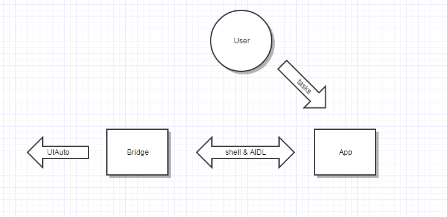

# Tasker
Running tasks based on any uiautomator API through this APP on Root devices

## Functional design

There are 2 parts to implement this goal:
1. Tasker-App, accept user tasks and route these commands to run test suit app, based on android junit test and uiautomator framework Instrumention decleared.

2. Tasker Module, the real tests container.

### How to setup you module app:

* Add dependencies
```
 compile 'com.android.support.test:runner:0.5'
    // Set this dependency to use JUnit 4 rules
    compile 'com.android.support.test:rules:0.5'
    // Set this dependency to build and run Espresso tests
    compile 'com.android.support.test.espresso:espresso-core:2.2.2'
    // Set this dependency to build and run UI Automator tests
    compile 'com.android.support.test.uiautomator:uiautomator-v18:2.1.2'
    compile 'com.github.Tornaco:Logger:1.1'
```

* Declare it a test app in AndroidManifest.xml
```
<instrumentation
        android:name="android.support.test.runner.AndroidJUnitRunner"
        android:functionalTest="false"
        android:handleProfiling="false"
        android:label="Tests for dev.tornaco.tasker"
        android:targetPackage="dev.tornaco.tasker" />
```

* Declare your modules in assets/xxx
```
[
    {
        "clz":"dev.tornaco.tasker.module.ExampleModule",
        "description":"Noop",
        "method":"pressHome",
        "testPkg":"dev.tornaco.tasker.module",
        "title":"Mock pressHome"
    },

    {
        "clz":"dev.tornaco.tasker.module.ExampleModule",
        "description":"Noop",
        "method":"showToast",
        "testPkg":"dev.tornaco.tasker.module",
        "title":"Mock toast"
    },
]
```


### Flow





### Code example

We can easily achive this goal: Launcher an app and find an UI object and perform a lot of actions.

```java
    @Before
    public void setup() {
        showToast("@Before");
    }

    @After
    public void teardown() throws InterruptedException {
        showToast("@After");
        // Wait for dismiss.
        sleep(3 * 1000);
    }

    @Test
    public void pressHome() {
        UiDevice device = UiDevice.getInstance(InstrumentationRegistry.getInstrumentation());
        device.pressHome();
    }

```

------------------
